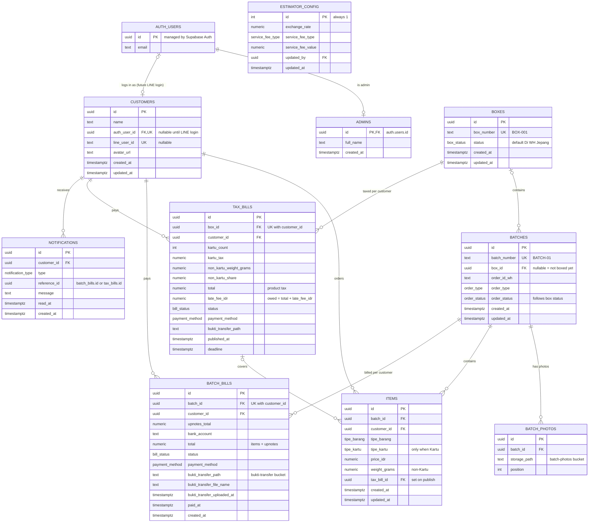

# ERD — GO Aikatsu Admin Dashboard

Database schema for Supabase (Postgres). Source of truth:
[`supabase/migrations/0001_init.sql`](../supabase/migrations/0001_init.sql),
built to match [`src/types.ts`](../src/types.ts). The diagram renders on
GitHub and in VS Code (Markdown Preview Mermaid Support extension); you can
also paste the code block into <https://mermaid.live>.

`ESTIMATOR_CONFIG` stands alone (single row) and has no relationship lines.

## How `src/types.ts` maps to tables

| App type (`src/types.ts`) | Table | Notes |
|---|---|---|
| `Customer` | `customers` | `name` only today; `auth_user_id`/`line_user_id` are for the future Customer Dashboard |
| `Box` | `boxes` | `Box.batchIds` is **not a column** — it's every `batches` row with that `box_id` |
| `Batch` | `batches` + `batch_photos` | `photoDataUrls` → one `batch_photos` row per photo; the file itself is in Storage |
| `Item` | `items` | `tax_bill_id` added so `TaxBill.itemIds` can be rebuilt |
| `BatchBill` | `batch_bills` | `itemIds` = items with the same `(batch_id, customer_id)`; `batchNumber` read from the batch |
| `TaxBill` | `tax_bills` | `itemIds` = items whose `tax_bill_id` is this bill |
| `BuktiTransfer` | columns on both bill tables | `payment_method`, `bukti_transfer_*`; file in the private `bukti-transfer` bucket |
| `EstimatorConfig` | `estimator_config` | one row, `id = 1` |
| — | `admins` | who may use the Admin Dashboard |
| — | `notifications` | filled automatically by triggers, for the Customer Dashboard |

## Enums

| Enum | Values |
|---|---|
| `tipe_barang` | Kartu, Ganci, Binder, Boneka, Sleeve, Standee, Lainnya |
| `tipe_kartu` | Tops, Skirt, Shoes, Set, Accessories, Dress |
| `order_status` | Dibeli dari Seller, Di WH Jepang, Dikirim ke Indonesia, Di Bea Cukai, Di WH Indonesia, Selesai |
| `box_status` | same as `order_status` minus "Dibeli dari Seller" |
| `order_type` | ReqShare, Admin, Persod |
| `bill_status` | Belum Bayar, Menunggu Konfirmasi, Lunas (shared by both bill tables) |
| `payment_method` | QRIS, Shopeepay, DANA, GoPay, BCA, SeaBank |
| `service_fee_type` | flat, percentage |
| `notification_type` | batch_bill_published, tax_bill_published, payment_confirmed, payment_rejected |

## Business rules enforced in the database

These match `src/store/useStore.ts` and `src/lib/deleteGuards.ts`, so they
hold even if someone edits data outside the app:

- A batch with no box is always `Dibeli dari Seller`; once boxed, its
  `order_status` equals the box's status (`box_drives_status` check + `save_box`).
- A box's batch list locks once its status leaves `Di WH Jepang`; only
  boxes still at `Di WH Jepang` can be deleted (`save_box`, `delete_boxes`).
- A batch can't be deleted if any of its items is in a tax bill, or any of
  its bills is `Lunas`/`Menunggu Konfirmasi` (`delete_batches`).
- Tax bills are published once per box, only at `Di Bea Cukai` or later
  (`publish_tax_bills`); a non-`Belum Bayar` tax bill can't be deleted (trigger).
- One batch bill per (batch, customer), one tax bill per (box, customer) — unique constraints.
- `tipe_kartu` is required for Kartu items and forbidden otherwise; prices > 0.
